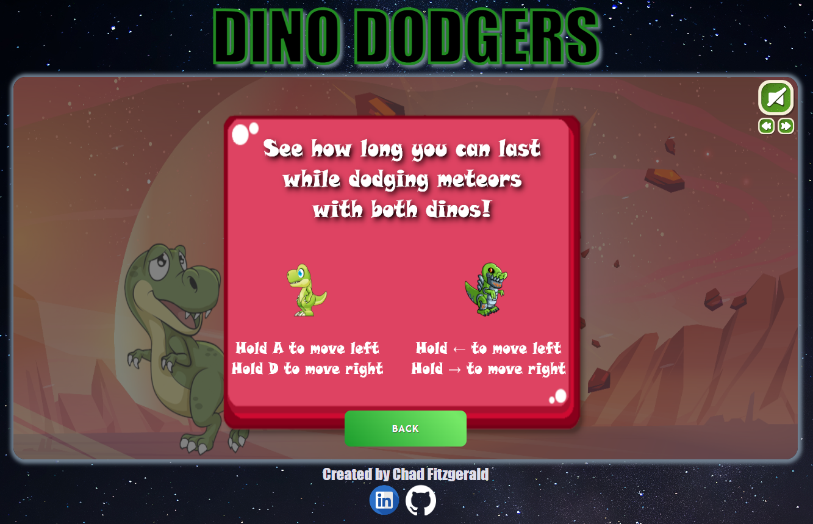
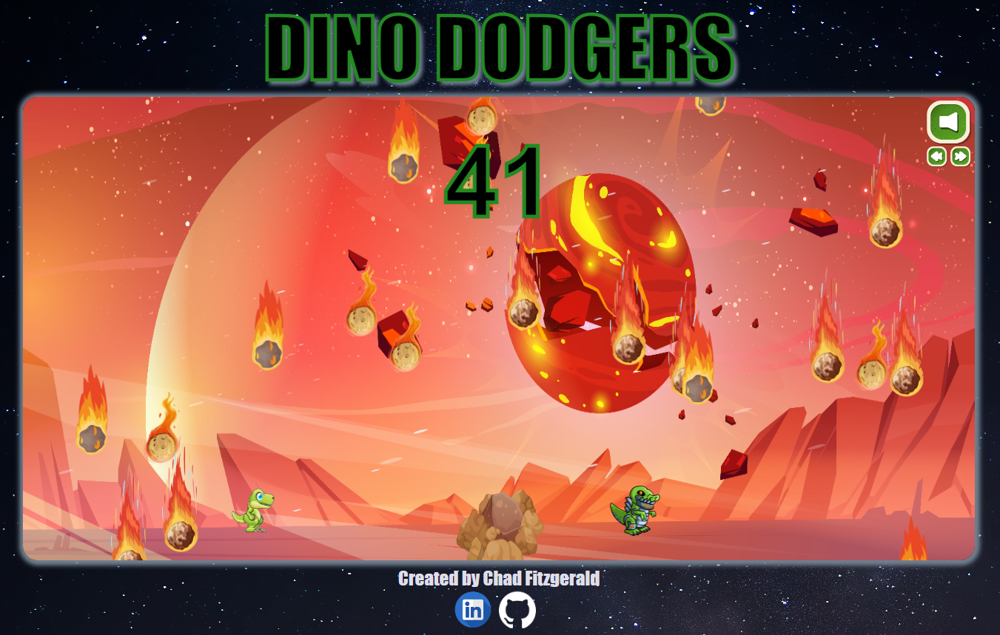
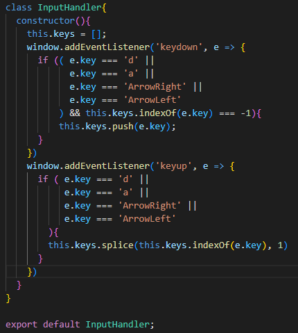
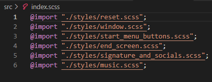

# DINO DODGERS
---
[Click to Play!](https://chadfitz.github.io/DINO-DODGERS/)
---
## Overview
DINO DODGERS is a simple game for entertainment purposes. Players control two dinosaurs at the same time, moving left and right to dodge falling meteors. The objective is to last for as long as possible, as hitting a meteor with either dinosaur results in game over.  
---
## Gameplay Screenshots
  
  
---
## The Code
Gameplay is organized into various classes based on function, and each class is responsible for distinct actions. This, alongside clear naming and file organization, makes the code easy to read and work with.
  
  
---  
## Technologies Implemented
- Vanilla Javascript
- HTML5 Canvas
- CSS
- Webpack/Babel