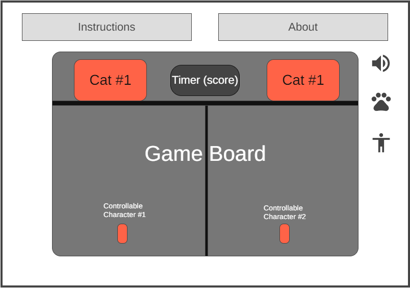

Background:  
  I am creating a game where the user controls two characters at the same time, splitting the screen in half vertically. 
These characters will be dodging items falling down from the top of the canvas. The only inputs during play will be 
moving left and right. The left character will be controlled using A(left)/D(right), and the right character will be 
controlled using left/right arrow keys. Currently, I am not sure whether it will be fluid left/right movement or just 
two positions they jump between. I am also uncertain as to whether or not I should vary the densities (fall speed) of 
the objects.  
  Visually, my initial idea is to have two cats sitting at the top of the canvas with conveyor belts bringing them 
objects to swat down towards the characters. There should be a timer incrementing at the top during play, and the goal 
of the game is to last for as long as possible. When either character gets hit by a falling item, it is game over. When 
this happens, the user's time will be displayed more prominently as their final score.  

Functionality & MVPs  
In {project name}, users will be able to:
  - control the lateral movement of two characters at the same time
  - toggle the sound on/off
  - read the directions at any point
  - pause

In addition, this project will include:
  - instructions detailing the instuctions
  - a production README

Wireframe
  

  - About activates a pop-up with my name, links to the Github repo
  - Instructions activates a pop-up with the instructions and a short description of the goal
  - A toggle for sound on/off
  - (bonus) options to change the design between a few predetermined cats/playable characters

Technologies, Libraries, and APIs
  - vanilla JavaScript

Implementation Timeline
  - Friday through Weekend: 
    - setup project and webpack
    - get game canvas to show on screen
    - implement basic controls and game logic
  - Monday
    - finalize controls
    - finalize game logic
    - figure out how to start making stuff look pretty
    - get more acquainted with library/canvas
  - Tuesday
    - figure out sound
    - styling
  - Wednesday
    - focus on styling
  - Thursday
    - continue styling and maybe add some of the bonus features

Bonus Features
  - add different playable characters or cats
  - add different densities/fall speeds

Live Project
☐ Includes links to your portfolio website, Github, and LinkedIn.

☐ Landing page/modal with obvious, clear instructions.

☐ Interactivity of some kind.

☐ Well styled, clean frontend.

☐ If it has music, the option to mute or stop it.

Production README
☐ Link to live version.

☐ Instructions on how to play/interact with the project.

☐ List of technologies / libraries / APIs used.

☐ Technical implementation details with (good-looking) code snippets.

☐ To-dos / future features.

☐ No .DS_Store files / debuggers / console.logs.

☐ Organized file structure, with /src and /dist directories.